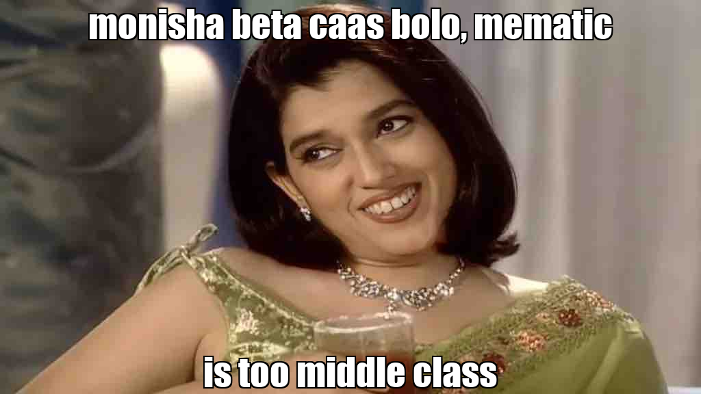
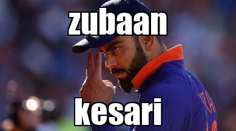

# Captioning-as-a-Service

Have you ever wanted a personal meme editor to add whatever caption you want? CaaS does exactly that even though there are many options that are way simpler to use, you have to use CaaS, coz it has "as a service" in its name and saying you edit memes on instagram is too middle class.




The main idea of our project is allowing anyone to give anything as captions to whatever image they want. The project has been deployed on heroku and can be used anytime.

# How to use CaaS

All you need to do to use CaaS is upload the image you want to add caption to and type the caption you want. The base URL is ```https://caasapp.herokuapp.com/```. 

One of the results from using the app:




# Inspiration to make Caption as a Service

PES 2023 biggest inspiration has always been Baral mama and this repo has taken his infamous Spongebob as a Service which was specific to Spongebob meme and converted it into more general any meme you want.

Feel free to contribute with more features or how to improve our code.
